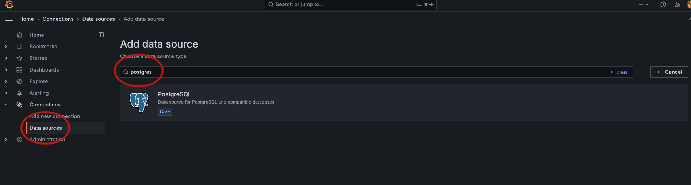
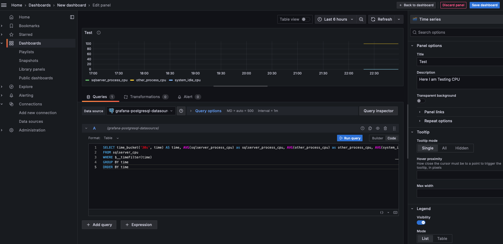

## <span style="color: red;">Note: The following instructions have been tested on Mac and WSL (in windows). They will need to be changed for running on Windows directly.</span>

# How to build project for testing

1. run the following script to create these directories (run this from the observability2 folder)
format is "./container-data/{containername}/data" so if you want to add additional containers, follow this pattern (this is done because this data will be removed by .gitignore)

```shell
mkdir -p ./container-data/sqlserver2022_01/data
mkdir -p ./container-data/sqlserver2022_02/data
mkdir -p ./container-data/timescaledb/data
mkdir -p ./container-data/grafana/data
chmod -R 777 ./container-data
```

2. Create a .env file in the same observability2 folder (it should be at the same level as the docker-compose.yml file). 
run the following commands, and it will create the .env file with the correct environment variables created. Replace all passwords with ones you will use for your setup.
```shell
touch .env
echo "SQL_SERVER_SA_PASSWORD=YourStrongPassw0rd" > .env
echo "TIMESCALEDB_POSTGRES_PASSWORD=YourStrongPassw0rd" >> .env
echo "TELEGRAF_SQL_SERVER_PASSWORD=YourStrongPassw0rd" >> .env
```

3. Stand up the test environment with docker-compose:

```shell
docker-compose up
```   

# How To Connect To the Services:

### To connect to SQL Server container :     

* **SERVER**: localhost (do not need to specify port for sqlserver01, for sqlserver02 you'll need to use the exposed port in docker-compose)   
* **LOGIN**: sa   
* **PASSWORD**: {{use password from .env file}}  


### To connect to postgres container database from Azure Data Studio (ADS)   

* **SERVER**: localhost (do not need to specify port)   
* **LOGIN**: postgres   
* **PASSWORD**: {{use password from .env file}}  
* **DATABASE**: postgres 


### Login to Grafana:

* **URL**: http://localhost:3000
* **LOGIN**: admin
* **PASSWORD**: admin (will be prompted to change)   


# ConFigure Grafana:

1. Create new datasource: postgres (use grafana native)



2. Fill out the connection information. Click **Save and Test** when done. If successful will get a message saying "Database Connection OK"   

* **SERVER**: timescaledb:5432
* **LOGIN**: postgres
* **PASSWORD**: {{use password from .env file}} 
* **DATABASE**: postgres
* **TLS/SSL MODE** Disable SSL
* **TIMESCALEDB** Enable

3. Now Create your first dashboard. A Simple test would be to verify you can query the CPU metric:

Query to get CPU and group on SQL_Instance:   

```SQL
SELECT time_bucket('30s', time) AS time,sql_instance, AVG(sqlserver_process_cpu) as sqlserver_process_cpu, AVG(other_process_cpu) as other_process_cpu, AVG(system_idle_cpu) as system_idle_cpu
FROM sqlserver_cpu
WHERE $__timeFilter(time)
GROUP BY sql_instance,time
ORDER BY time
```   

   


